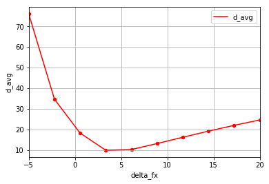
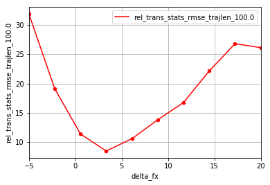
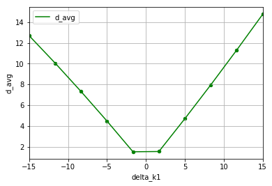
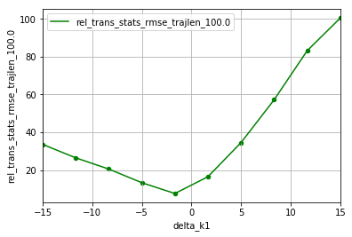

# VO-Pipeline Evaluation

In this experiment, we try to evaluate how knowing incorrect calibration parameters affect the accuracy of Visual-Odometry 
pipelines. In particular, we evaluate against monocular [ORBSLAM](http://webdiis.unizar.es/~raulmur/MurMontielTardosTRO15.pdf).

The evaluation is done in the following procedure:
1. Perturb the known camera parameters
2. Generate the configuration file which is used to run OrbSLAM
3. Perform VO-evaluation and plots results

## Dataset 

We use KITTI dataset in this experiment. Any of the datasets with odometry groundtruth (i.e. sequence numbers 00-10) can be used. To save some time downloading,
following is the mapping between sequence number and name:

| __Nr.__ | __Sequence Name__ | __Start Frame__ | __End Frame__ |   
|---------|-------------------|-----------------|---------------|   
| 00: | 2011_10_03_drive_0027 | 000000 | 004540 |
| 01: | 2011_10_03_drive_0042 | 000000 | 001100 |
| 02: | 2011_10_03_drive_0034 | 000000 | 004660 |
| 03: | 2011_09_26_drive_0067 | 000000 | 000800 |
| 04: | 2011_09_30_drive_0016 | 000000 | 000270 |
| 05: | 2011_09_30_drive_0018 | 000000 | 002760 |
| 06: | 2011_09_30_drive_0020 | 000000 | 001100 | 
| 07: | 2011_09_30_drive_0027 | 000000 | 001100 |
| 08: | 2011_09_30_drive_0028 | 001100 | 005170 |
| 09: | 2011_09_30_drive_0033 | 000000 | 001590 |
| 10: | 2011_09_30_drive_0034 | 000000 | 001200 |


1. Download the corresponding sequence: http://www.cvlibs.net/datasets/kitti/raw_data.php
2. Download the groundtruth and timestamp information from: http://www.cvlibs.net/datasets/kitti/eval_odometry.php 
3. Paste the following files into "KITTI_parameters/<seq-name>" directory:  
    a. The calibration file in  as `camera.yaml`  
    b. `gt_kitti.txt` and `times.txt` files corresponding to the sequence   
    
## Trajectory Evaluation

Since monocular odometry works well up to a scale, we consider relative errors in sub-trajectories as the metric.

Following the paper: ["A Tutorial on Quantitative Trajectory Evaluation"](http://rpg.ifi.uzh.ch/docs/IROS18_Zhang.pdf) by Zhang
_et. al_, 
the algorithm used is described briefly as follows:

1. Select all sub-trajectory of length d.
2. Align each sub-trajectory using the first state.
3. Calculate the error of the end state of each sub-trajectory.
4. Collect the errors for all the sub-trajectories.
5. For different lengths d, repeat step 1-4.

## ORB-SLAM

Released in 2016, ORB-SLAM is one of the most popular algorithms for monocular SLAM.  It is able to close large loops and
perform global re-localisation in real-time and from wide baselines. Due to the popularity of the algorithm, we use it to 
check how robust the algorithm is to miscalibration in camera parameters. 

1. Clone the fork of the repository:    
        
        git clone -b feature/projects https://github.com/Mayankm96/ORB_SLAM2.git
         
2. Build the fork by following the instructions present in the ORB-SLAM's repository README:        
        
        cd ORB_SLAM2    
        chmod +x build.sh   
        ./build.sh  

This will create `libORB_SLAM2.so` at _lib_ folder and the executables `mono_plr` in _Projects/PLR_Evaluation_ folder.

## Running the ORBSLAM-Evaluation script

First install the python dependencies required:
```bash
# UZH Trajectory Evaluation toolbox (present as git submodule)
git submodule init && git submodule update
# EVO: https://github.com/MichaelGrupp/evo
pip install evo --upgrade --no-binary evo
# CarnivalMirror: https://github.com/AleksandarPetrov/carnivalmirror.git
pip install carnivalmirror
# other standard python
pip install matplotlib numpy pandas opencv-python
```

To run the script `run_orbslam.py`, care needs to be taken in the parameters specified. The script requires the following:
* `--orbslam_root` , `-b`: path to ORBSLAM2 directory
* `--dataset_folder` , `-k`: path to a directory containing KITTI sequence dataset
* `--sequence_name` , `-e`: name of the KITTI sequence
* `--sampling_settings` , `-s`: path to a file with the sampling settings (default: `config/sampling_settings.yaml`)
* `--num_of_runs` , `-n`: number of runs to perform (default: `6`)
* `--experiment_type`, `-t`: type of experiment to perform (range/random) (default: `range`)
* `--perturb_focal`, `-f`: perturb focal length parameters of the camera (y/n) (default: `y`)
* `--perturb_principle_point`, `-c`: perturb principle point parameters of the camera (y/n) (default: `y`)
* `--perturb_distortion`, `-k`: perturb distortion parameters of the camera (y/n) (default: `n`)
* `--output_dir` , `-o`: path of the directory to save experiment resutls in (default: `eval`)

### Example:
```bash
# to perturb only intrinsic calibration matrix 
python run_orbslam.py -b ~/my_projects/ORB_SLAM2 \ 
                      -k ~/my_projects/data/kitti/2011_09_30_drive_0034 \
                      -e 2011_09_30_drive_0034 \
                      -t range \
                      -f y -c y -k n             
```

For each run in an experiment, the following information are stored:
1. an example raw image from the dataset
2. rectified image from the perturbed calibration parameters
3. diagnostoc image with useful information about the perturbation performed
4. configuration file for orbslam with the perturbed calibration settings
5. keyframe trajectory outputted from running OrbSLAM on that sequence
6. evaluation statistics on the estimated trajectory and plots

A `csv` file is also generated which contains all the summary information about the experiment. These include the camera 
parameters, average reprojection error, relative errors in evaluated trajectory etc. The file can be loaded as a panda dataframe
and be used to plot the data collected to observe trends. The jupyter notebook `correlation_plotting.ipynb` is an example 
on how this can be done.


### Results:


On x-axis, the % change in the the parameter is plotted.

#### Perturbing intrinsic parameters only:

Reprojection Error (in pixels)           |  Trajectory Evaluation (in m)
:-------------------------:|:-------------------------:
  |  

#### Perturbing distortion parameters only:

Reprojection Error (in pixels)             |  Trajectory Evaluation (in m)
:-------------------------:|:-------------------------:
  |  